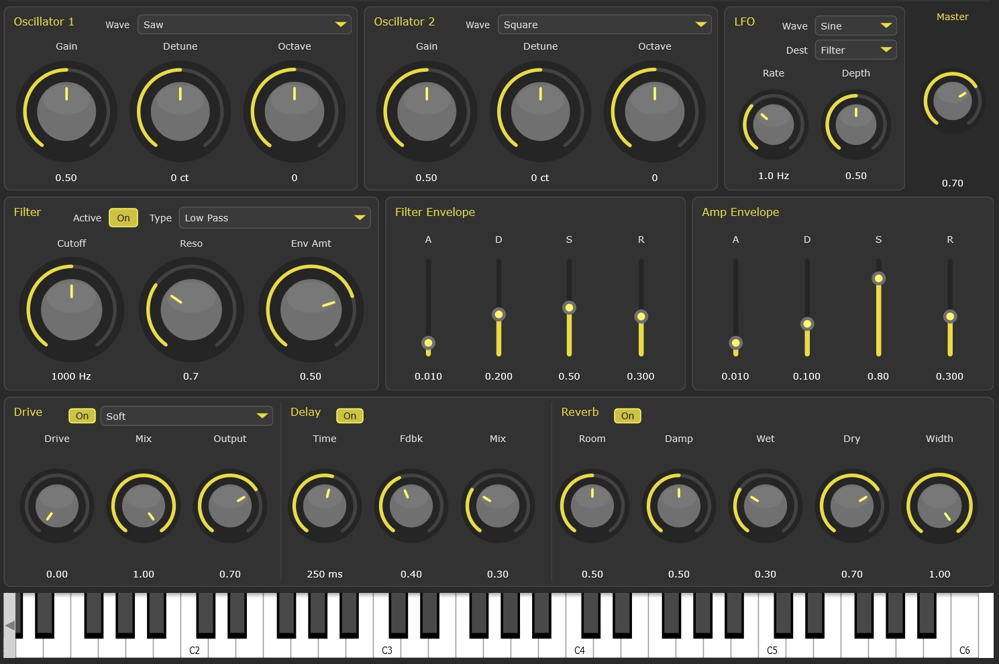

```
──────────  ::ασε~  ──
alien sound engineering
S  Y  N  T  H  .  0  1
```
Virtual analog subtractive synthesizer VST3 plugin built with JUCE



---

## Overview

**CodingSounds Synth** is a classic subtractive synthesizer featuring dual anti-aliased oscillators, a state-variable filter with envelope and LFO modulation, and a full effects section. Built with modern C++20 and the JUCE framework, it delivers cool sounds in both VST3 plugin and standalone formats.

---

## Features

```
┌─────────────────────────────────────────────────────────────────────────────┐
│  DUAL OSCILLATORS  │  STATE-VARIABLE FILTER  │  DUAL ADSR  │  MULTI-FX      │
├─────────────────────────────────────────────────────────────────────────────┤
│  • PolyBLEP anti-aliasing          • 8-voice polyphony                      │
│  • Sine / Saw / Square             • Tempo-sync delay                       │
│  • ±600 cents detune               • 4 distortion types                     │
│  • ±2 octave shift                 • Full reverb engine                     │
│  • 6 LFO destinations              • Preset system                          │
└─────────────────────────────────────────────────────────────────────────────┘
```

---

## Signal Flow

```
                              ┌─────────────┐
                              │   MIDI IN   │
                              └──────┬──────┘
                                     │
                    ┌────────────────┴────────────────┐
                    ▼                                 ▼
            ┌─────────────── ┐                 ┌────────────────┐
            │  OSCILLATOR 1  │                 │  OSCILLATOR 2  │
            │  ┌─────────┐   │                 │  ┌─────────┐   │
            │  │Sine/Saw/│   │                 │  │Sine/Saw/│   │
            │  │ Square  │   │                 │  │ Square  │   │
            │  └─────────┘   │                 │  └─────────┘   │
            │  Gain │ Detune │                 │  Gain │ Detune │
            │    Octave      │                 │    Octave      │
            └───────┬────────┘                 └───────┬────────┘
                    │                                  │
                    └────────────┬─────────────────────┘
                                 ▼
                    ┌────────────────────────┐
                    │    STATE-VARIABLE      │◄──────┬──────────────┐
                    │       FILTER           │       │              │
                    │  ┌──────────────────┐  │   ┌───┴───┐    ┌─────┴─────┐
                    │  │ LP / HP / BP     │  │   │ FILTER│    │    LFO    │
                    │  │ Cutoff: 20-20kHz │  │   │  ADSR │    │  6 waves  │
                    │  │ Resonance: 0-10  │  │   └───────┘    │  6 dests  │
                    │  └──────────────────┘  │                └───────────┘
                    └───────────┬────────────┘
                                │
                                ▼
                    ┌────────────────────────┐
                    │    AMP ENVELOPE        │
                    │    (ADSR)              │
                    └───────────┬────────────┘
                                │
        ════════════════════════╪════════════════════════════
                          EFFECTS CHAIN
        ════════════════════════╪════════════════════════════
                                │
                                ▼
                    ┌────────────────────────┐
                    │   DRIVE / DISTORTION   │
                    │  Soft│Hard│Tube│Fuzz   │
                    └───────────┬────────────┘
                                │
                                ▼
                    ┌────────────────────────┐
                    │      DELAY LINE        │
                    │  1-2000ms │ Tempo Sync │
                    └───────────┬────────────┘
                                │
                                ▼
                    ┌────────────────────────┐
                    │        REVERB          │
                    │  Room │ Damp │ Width   │
                    └───────────┬────────────┘
                                │
                                ▼
                        ┌──────────────┐
                        │  MASTER OUT  │
                        └──────────────┘
```

---

## Technical Specifications

### Oscillator Section

| Parameter | Range | Description |
|-----------|-------|-------------|
| Waveforms | Sine, Saw, Square | PolyBLEP anti-aliased |
| Gain | 0.0 - 1.0 | Per-oscillator volume |
| Detune | ±600 cents | Fine pitch adjustment |
| Octave | ±2 octaves | Coarse pitch shift |
| Pitch Wheel | ±2 semitones | Real-time pitch bend |

### Filter Section

| Parameter | Range | Description |
|-----------|-------|-------------|
| Type | LP / HP / BP | State-variable topology |
| Cutoff | 20 Hz - 20 kHz | Filter frequency |
| Resonance | 0.1 - 10.0 | Q factor |
| Env Amount | -1.0 - +1.0 | 4 octave modulation depth |
| LFO Mod | 2 octaves | LFO modulation range |

### Envelope Generators (×2)

| Parameter | Range | Default (Amp/Filter) |
|-----------|-------|----------------------|
| Attack | 0.001 - 5.0 s | 0.01 / 0.01 s |
| Decay | 0.001 - 5.0 s | 0.1 / 0.2 s |
| Sustain | 0.0 - 1.0 | 0.8 / 0.5 |
| Release | 0.001 - 10.0 s | 0.3 / 0.3 s |

### LFO

| Parameter | Options/Range |
|-----------|---------------|
| Waveforms | Sine, Triangle, Square, Saw Up, Saw Down, Random (S&H) |
| Rate | 0.01 - 20 Hz |
| Depth | 0.0 - 1.0 |
| Destinations | Filter Cutoff, Osc1 Pitch, Osc2 Pitch, Osc1 Gain, Osc2 Gain |

### Effects

#### Drive/Distortion
| Type | Character |
|------|-----------|
| Soft | Warm `tanh()` saturation |
| Hard | Aggressive clipping |
| Tube | Asymmetric valve simulation |
| Fuzz | Polynomial waveshaping |

#### Delay
- **Time**: 1 - 2000 ms
- **Feedback**: 0 - 95%
- **Tempo Sync**: Host BPM sync with note divisions
- **Stereo**: Independent L/R processing

#### Reverb
- Room Size, Damping, Wet/Dry, Width controls
- JUCE reverb engine

---

## Voice Architecture

```
┌──────────────────────────────────────────────────────────────────────┐
│                        8-VOICE POLYPHONY                             │
├──────────────────────────────────────────────────────────────────────┤
│  Each voice contains:                                                │
│    • 2× Oscillators (independent phase)                              │
│    • 1× State-variable filter                                        │
│    • 1× Amplitude envelope                                           │
│    • 1× Filter envelope                                              │
│    • Velocity sensitivity                                            │
│    • Per-voice LFO modulation                                        │
└──────────────────────────────────────────────────────────────────────┘
```

---

## Build Instructions

### Requirements

- **CMake** 3.22+
- **C++20** compatible compiler
- **JUCE** framework (included as submodule)

### Building

```bash
# Clone the repository
git clone --recursive https://github.com/your-username/CodingSounds-Synth.git
cd CodingSounds-Synth

# Create build directory
mkdir build && cd build

# Configure
cmake ..

# Build
cmake --build . --config Release
```

### Output

- **VST3 Plugin**: `build/CodingSoundsSynth_artefacts/Release/VST3/`
- **Standalone App**: `build/CodingSoundsSynth_artefacts/Release/Standalone/`

---

## Project Structure

```
Synth.01/
├── Source/
│   ├── Synth/                 # Core synthesis engine
│   │   ├── Oscillator         # PolyBLEP waveform generation
│   │   ├── Filter             # State-variable filter (SVF)
│   │   ├── AdsrEnvelope       # ADSR envelope generator
│   │   ├── LfoGenerator       # Multi-wave LFO
│   │   ├── SynthVoice         # Voice processor
│   │   └── SynthSound         # Sound definition
│   │
│   ├── Effects/               # Post-processing
│   │   ├── DriveDistortion    # 4-type distortion
│   │   └── DelayLine          # Tempo-sync delay
│   │
│   ├── GUI/                   # User interface
│   │   ├── CustomLookAndFeel  # Dark theme styling
│   │   ├── OscillatorComponent
│   │   ├── FilterComponent
│   │   ├── AdsrComponent
│   │   ├── LfoComponent
│   │   ├── EffectsComponent
│   │   └── PresetComponent
│   │
│   ├── Preset/                # Preset management
│   │   └── PresetManager
│   │
│   ├── PluginProcessor        # Audio processing
│   └── PluginEditor           # Plugin GUI
│
├── JUCE/                      # JUCE framework
├── CMakeLists.txt             # Build configuration
└── README.md
```

---


## Credits

**CodingSounds Synth** is built with:
- [JUCE](https://juce.com/), a cross-platform C++ framework for audio applications
- Inspiration from classic analog synthesizers


